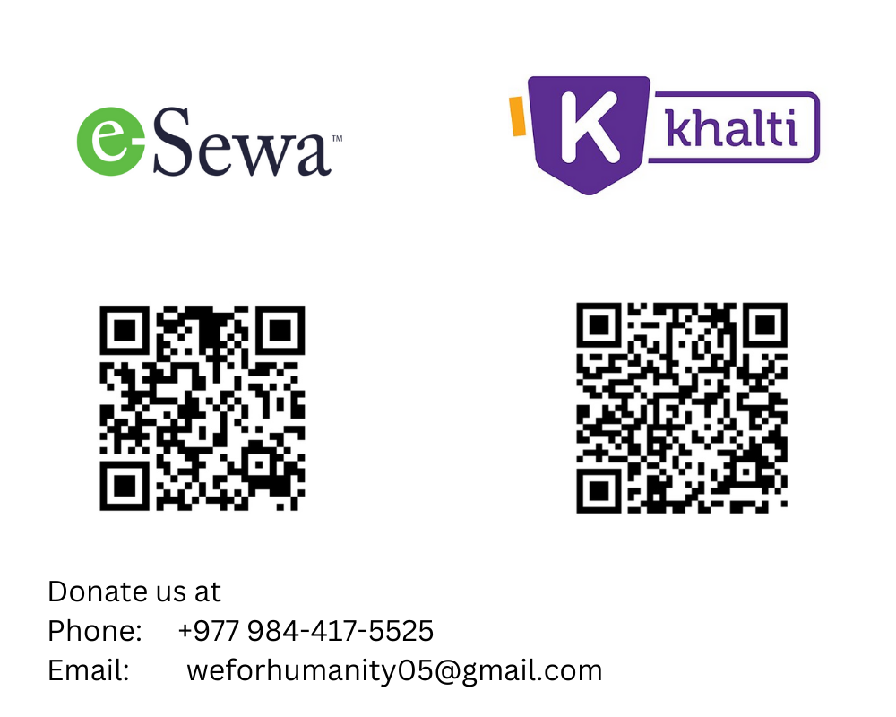
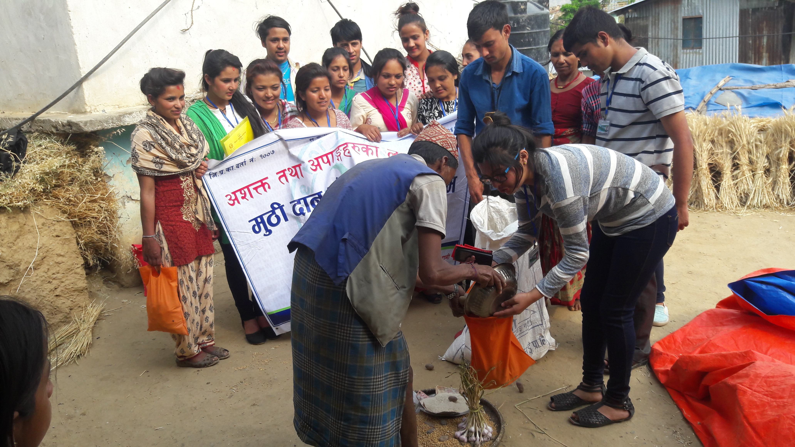

# Start helping Today!

Welcome to "We For Humanity"! Our organization works to help those in need. Whether you want to donate money or offer other types of support, your help is very important. This guide will show you the different ways you can get involved and make a difference.

## How you can help?
Your support can make a real impact in the lives of those in need. Join us in our efforts by donating, volunteering, or fundraising. There are plenty of ways to contribute and help us create bigger impact. 
### Monetary Donation
A monetary donation allows you to make a contribution to support our ongoing projects. Your gift will help us provide immediate assistance to those in need. You can support us via Esewa and Khalti in Nepal.
  - Please contact us via email or phone if you are planning to donate from foreign nations.
  - Email: [weforhumanity05@gmail.com](mailto:weforhumanity05@gmail.com)
  - Phone: +977 984-421-1835
### Material Donation
We accept material donations, such as clothing, food, educational supplies, or other goods that directly support our programs. Please contact us at [weforhumanity05@gmail.com](mailto:weforhumanity05@gmail.com) 

## Where does my donation go?
- Your donation helps provide food, education, and healthcare to individuals and families who need it most.
- It makes it possible for us to offer support directly to those facing difficulties in their life. 

## Contact Us
For any questions or suggestions, please feel free to contact us.
  - Email: [weforhumanity05@gmail.com](mailto:weforhumanity05@gmail.com)
  - Phone: +977 984-421-1835

Thank you for your contribution to "We For Humanity"! Together, we can reach those in need and make a difference.
